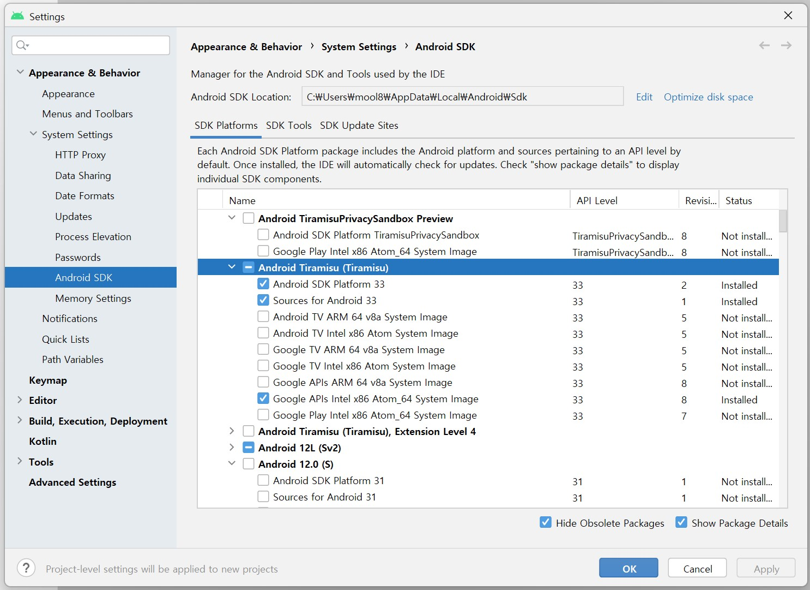
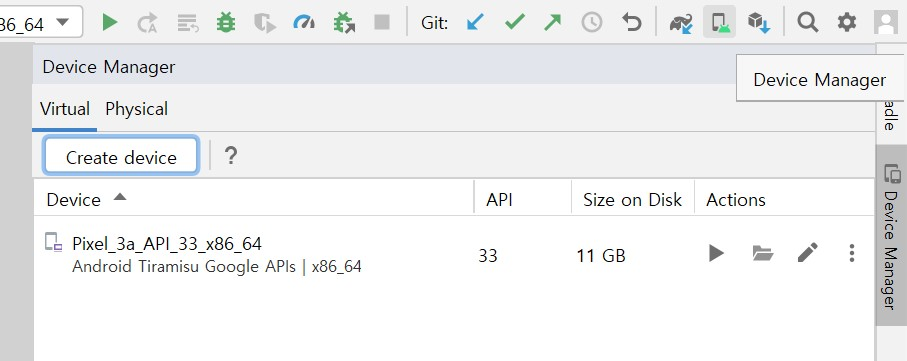
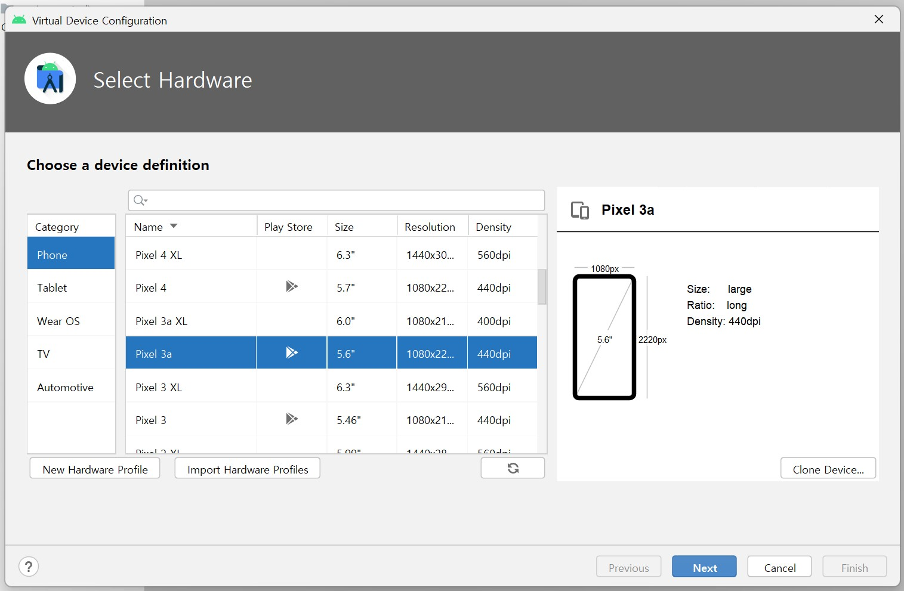
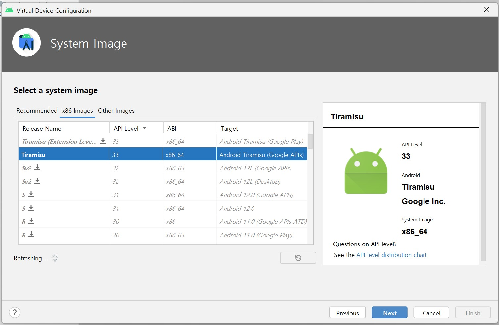
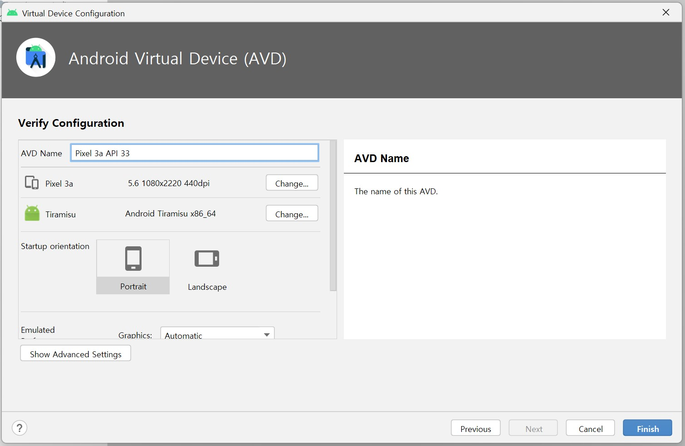

# GURU2_Hackathon_Team4
* SDK 버전: 33 (가장 최신 것)
  * SDK Manager > SDK Platform > Show Package Details 체크박스 선택 후, 아래 사진처럼 선택 후(Install)
  

* 애뮬레이터 설정
  
  
  
  
  
  그냥 시스템 이미지 설정 같긴 하지만.. 통일하는 게 좋을듯..?
  
  원래 우리 계획대로면 Startup orientation이 가로여야 맞지만, 초안이기 때문에 세로형. 추후 수정 가능. 각자 작업할 때는 원래 가로라는 것 기억하기
