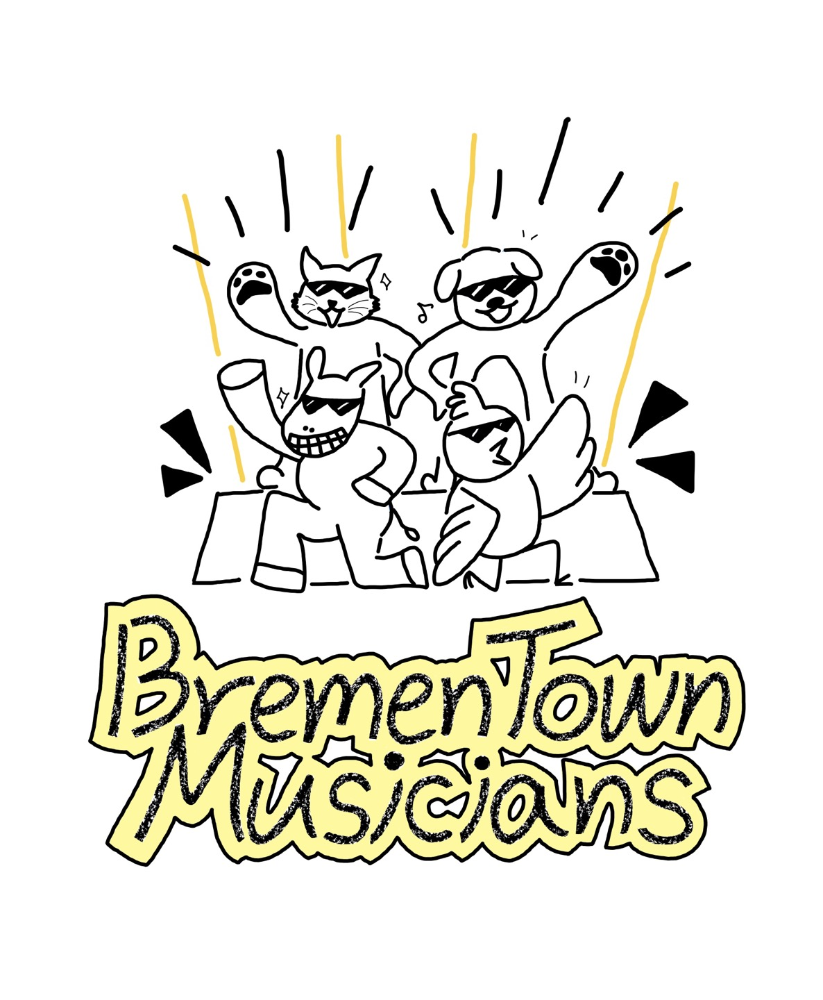

# 2022년 겨울 Programming GURU2 Android - 4팀(All:바른연주)
## Project: 브레멘 음악대(Bremen Town Musicians) 🐱🐶🐴🐔

### ✨브레멘 음악대(Bremen Town Musicians) 란?
어린이를 대상으로 한, 하지만 남녀노소 누구나 충분히 즐길 수 있는 종합 악기 연주 앱입니다. 
밴드로 돌아온 브레멘 음악대! 이들과 함께 즐거운 연주를 시작해볼까요?

### 🚨코드 실행 시 유의사항
원활한 실행을 위해 아래 버전으로 설정하는 것을 권장드립니다.
* SDK 버전: 33 (complieSdk: 33, minSdl: 24, targetSdk: 33)
* 적정 에뮬레이터 버전: Pixel 3a 33

### 👩‍💻**4팀(All:바른연주) 팀원**
* 서울여자대학교 데이터사이언스학과 2021111729 오수민
* 서울여자대학교 데이터사이언스학과 2021111714 김서연
* 서울여자대학교 데이터사이언스학과 2021111726 양혜성
* 서울여자대학교 데이터사이언스학과 2021111734 장진영
